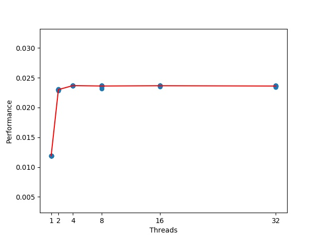

# Matrix multiplication using threads

Para compilar el proyecto ejecutar
```bash
make
```

Sea A una matrix de n x m

Sea B una matrix de p x q

El formato de la entrada es:
```bash
n m
a0,0 a0,1 ... a0,n-1
a1,0 a1,1 ... a1,n-1
.
.
.
an-1,0 an-1,1 ... an-1,n-1
p q
b0,0 b0,1 ... b0,n-1
b1,0 b1,1 ... b1,n-1
.
.
.
bn-1,0 bn-1,1 ... bn-1,n-1
```

Para generar una entrada aleatoria con matrices cuadradas de dimensión, por ejemplo 10, y guardarlo en un archivo `in.in` ejecutar
```bash
./generate-matrix 10 >in.in
```

Para obtener la multiplicación de matrices con un programa simple (sin usar threads) ejecutar
```bash
./simple <in.in
```

El programa de multiplicación de matrices que utiliza threads y el principio de localidad es `multiplication`

Para obtener los argumentos que acepta ejecutar

```bash
./multiplication -h
```

Con lo anterior se obtiene

```bash
Options:
  -n <numero_hilos>              indica el número de hilos
  -m                             no imprimir la matrix resultante
  -t                             imprimir el tiempo que demoró la multiplicación
  -a                             ejecutar el programa usando todos los hilos de la máquina

```

Entonces, por ejemplo, para correr el programa usando dos hilos e imprimiendo el tiempo que demoró en hacer la multiplicación, ejecutar
```bash
./multiplication -n 2 -t <in.in
```

Para correr el programa usando todos los hilos que tiene la computadora donde se está corriendo el programa, ejecutar
```bash
./multiplication -a -t <in.in
```

Para correr una serie de tests aleatorios ejecutar
```bash
bash run.sh
```

Usando el script anterior (por ahora se ha modificado para que no se ejecute esa parte) se obtuvo los distintos tiempos que tomó multiplicar matrices aleatorios de
5000 x 5000. Estos tiempos se puedes encontrar en [times-obtained](./times-obtained)

Además, se realizó un programa en python obtener una gráfica de número de hilos vs Performance a partir de los datos obtenidos.

Para generar la gráfica ejecutar
```bash
python3 graphics.py
```

Con lo anterior se obtuvo, en mi caso, el siguiente gráfico



**Extra.** Originalmente, este proyecto era un laboratorio del curso de Arquitectura de Computadoras, por ello hay un informe sobre este trabajo en [Informe.pdf](./Informe.pdf)
